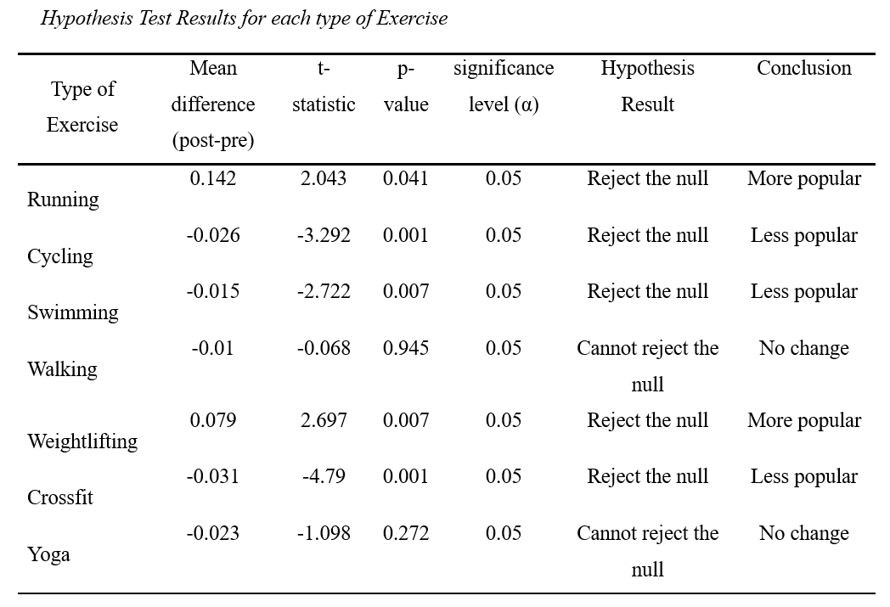

# Masters-Research-Project
Michael O’Donnell
City University of New York, School of Professional Studies
DATA698, Analytics Master’s Research Project
Dr. Paul Bailo
December 3, 2020

## Abstract:
The new coronavirus disease that emerged in 2019, COVID-19, modified many day-to-day behaviors in the United States (Tynan & Howard, 2020). Certain behaviors changed naturally, such as Netflix viewing habits, while others changed in accordance with government orders, such as restriction of indoor restaurant dining (Gostin & Wiley, 2020). One aspect of day-to-day behavior in the US that seemingly changed both naturally and as a result of government orders was exercise (Ramirez-Campillo & Souza, 2020). Exercise behaviors are a significant component of overall American health, and this project will analyze apparent changes in these behaviors since the onset of COVID-19. More specifically, this project will use public data to measure changes in seven different types of US exercise routine. The goal of this project is to increase knowledge pertaining to US behavioral changes since the pandemic began with a healthy focus on exercise.

## Results:
